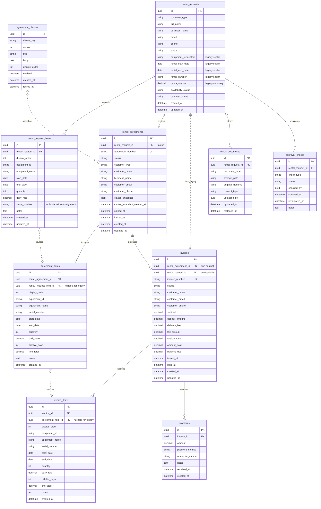

# Urban Cowboy Rentals — Release 1 Entity Relationship Diagram

## Purpose and Boundary

This ERD defines the Release 1 persistence model only. `rental_requests` remains the temporary workflow anchor. Normalized child rows support new multi-item requests while legacy scalar fields remain readable. Reusable customers, a Rental aggregate, inventory units, digital inspections, maintenance, and damage assessments are deferred.

## Release 1 Lifecycle

`Rental Request → Agreement → Original Invoice → Payment`

A request may exist without an agreement. An agreement may exist without an invoice. Payments belong only to an invoice. Required documents and approval checks temporarily remain attached to the request so Release 1 can ship without introducing the future Rental aggregate.

## Mermaid ER Diagram

The dashed clause and item-source relationships are lineage relationships. Agreement and invoice item snapshots remain independently renderable even when their optional source foreign keys are absent on legacy rows.

## Relationship Explanations

1. **`rental_requests` 1:N `rental_request_items`:** A request contains zero or more child items while being drafted and one or more before agreement creation. Child rows are authoritative for new multi-item requests.
2. **`rental_requests` 1:0..1 `rental_agreements`:** A request may produce one agreement. Release 1 should prevent multiple agreements for the same request.
3. **`rental_requests` 1:N `rental_documents`:** Driver-license, insurance, and other Release 1 files temporarily use the request as their owner. Storage objects remain private.
4. **`rental_requests` 1:N `approval_checks`:** Each required gate is independently auditable and can be invalidated without overwriting unrelated checks.
5. **`rental_agreements` 1:1..N `agreement_items`:** Every agreement contains at least one legal item snapshot. Each serialized physical unit normally has its own row with quantity `1`.
6. **`rental_agreements` 1:0..1 `invoices`:** An agreement may produce one original rental invoice. Draft agreements may have no invoice.
7. **`invoices` 1:1..N `invoice_items`:** An invoice contains at least one billing line copied from finalized agreement items.
8. **`invoices` 1:N `payments`:** An issued invoice may receive zero or more partial/full payments. Payments are append-only financial events.
9. **`rental_request_items` 0..1:N `agreement_items`:** A new agreement item should retain source lineage to a request item. One request line may split into several serialized agreement rows; legacy agreement items may have no source FK.
10. **`agreement_items` 0..1:0..1 `invoice_items`:** Each original-invoice line should retain lineage to one agreement item. The FK remains nullable for legacy invoices.
11. **`agreement_clauses` N:M `rental_agreements` (logical):** Enabled clause versions are copied into the finalized agreement snapshot. The Agreement renders the snapshot, not live clause-library text.
12. **`rental_requests` 1:0..1 `invoices` (legacy compatibility):** `invoices.rental_request_id` preserves current lookup compatibility, but the Agreement FK remains the canonical ownership path. The redundant request FK must agree with `rental_agreements.rental_request_id`.

## Architectural Assumptions

- Supabase/PostgreSQL remains the data platform. IDs are UUIDs; audit timestamps are timezone-aware.
- Agreement and invoice numbers are generated by trusted database/server logic and are collision-safe.
- Clause-library versions use a unique `(clause_key, version)` pair and are immutable after use.
- Currency uses exact decimals or integer cents; floats are not authoritative.
- New multi-item writes create normalized child rows. Legacy scalar fields remain temporary summaries for compatibility.
- Snapshot records preserve customer identity, equipment display name, serial number, dates, quantity, rate, billable days, notes, and calculated amounts as applicable.
- Serialized equipment normally uses quantity `1`. Non-serialized fungible items may use quantity greater than `1` only when one serial per unit is not required.
- Serial numbers are internal operational data. They belong in legal/billing item snapshots but are not rendered on public catalog pages.
- Agreement and invoice item rows become immutable with their finalized/issued parent, except through an explicitly approved correction workflow.
- `rental_documents` and `approval_checks` stay request-owned only for Release 1.
- Staff actor IDs may reference Supabase Auth users; that external auth entity is intentionally omitted from this Release 1 diagram.
- No table stores full card numbers or CVVs.

## Legacy Compatibility

- Existing request, agreement, and invoice scalar equipment/date fields remain in place during Release 1.
- Reads prefer normalized child rows when present. When none exist, an adapter synthesizes one in-memory item from the legacy scalar fields without mutating the row.
- New multi-item writes also maintain a human-readable scalar equipment summary where existing search/dashboard behavior requires it; child rows remain authoritative.
- Legacy agreement and invoice items may have null source-item FKs. New normalized records should populate lineage FKs.
- Archived catalog records and stable equipment IDs remain available for historical/direct-detail display; archived items are excluded from new requests.
- Before enforcing one-to-one uniqueness, production data must be checked for duplicate agreements per request and duplicate invoices per agreement.

## Delete and Retention Behavior

| Relationship or record | Recommended Release 1 behavior |
| --- | --- |
| Request → request items | `ON DELETE CASCADE` is acceptable only for a draft request with no downstream legal/financial record. |
| Request → agreement | `RESTRICT`/`NO ACTION`; a request with an agreement must not be hard-deleted. |
| Request → documents/checks | `RESTRICT`/`NO ACTION`; deletion must use an explicit retention workflow, including storage-object cleanup. |
| Agreement → agreement items | `RESTRICT`/`NO ACTION`; explicitly remove children only while the agreement is an unfinalized draft. |
| Agreement → invoice | `RESTRICT`/`NO ACTION`; an invoiced agreement cannot be hard-deleted. |
| Invoice → invoice items/payments | `RESTRICT`/`NO ACTION`; financial rows must survive cancellation and remain auditable. |
| Source-item lineage FKs | `RESTRICT`/`NO ACTION`; snapshots must not disappear because a source row is edited or retired. |
| Clause library | Clause versions are immutable and retired, not deleted; snapshots have no cascading dependency. |

Finalized agreements and their items, issued/cancelled invoices and their items, payments, clause versions used by finalized agreements, and requests/documents/checks supporting legal or financial records must never be hard-deleted. Use status transitions, cancellation, retirement, and retention-controlled purge procedures instead.

## Future Extension Points

- **Rentals:** Introduce the future Rental aggregate as the operational root after approval. It can reference the originating request, agreement, and original invoice without changing their historical snapshots.
- **Inventory Units:** Separate catalog products from serialized physical units. `agreement_items` and future inspection/maintenance records can reference an inventory unit while retaining serial/name snapshots.
- **Customers:** Add reusable Individual/Business customer profiles while keeping customer snapshots on legal and billing documents.
- **Inspections:** Add equipment-specific check-out/check-in templates and records linked to rental, inventory unit, customer, invoice, staff, photos, and signatures.
- **Maintenance and damage:** Add maintenance events and damage assessments against inventory units and rentals; do not overload approval checks or invoice items.
- **Documents and approvals:** Re-parent or add explicit Rental ownership after the Rental aggregate exists, with a controlled compatibility period for request-owned rows.

## Contradictions and Normalization Issues to Resolve Before Sprint 2

1. **Agreement uniqueness:** Enforce a database-level unique constraint on `rental_agreements.rental_request_id`, after auditing and resolving existing duplicates. Application idempotency alone is insufficient.
2. **Original invoice uniqueness:** Enforce one original invoice per agreement. A simple unique `invoices.rental_agreement_id` fits Release 1; if future credit/adjustment documents will share `invoices`, decide now whether to add an `invoice_type` and use a partial unique constraint instead.
3. **Request-item lineage:** `agreement_items.rental_request_item_id` should be nullable for legacy rows but required by validation for new normalized rows. Confirm whether a requested quantity may split into multiple serialized agreement items.
4. **Agreement-item lineage:** `invoice_items.agreement_item_id` should be nullable for legacy rows but required for new original invoices. Invoice rendering must still use invoice snapshots, not live agreement-item values.
5. **Approval representation:** Prefer individual `approval_checks` rows with a unique key on `(rental_request_id, check_type)`. Confirm the allowed check types, invalidation rules, and whether history requires append-only revisions instead of updating one row.
6. **Clause snapshots:** Keep a JSON snapshot on `rental_agreements` for Release 1 containing clause ID/key, version, title, body, and display order. Confirm the JSON contract and whether signatures bind to a snapshot hash/version identifier.
7. **Snapshot boundary:** Customer identity, equipment name/serial, dates, quantity, rate, notes, totals, agreement/invoice numbers, and legal text remain snapshots. Catalog, source-item, and actor FKs provide lineage only and must not drive historical rendering.
8. **Legacy adaptation:** Confirm the exact precedence rule when both child rows and scalar fields exist. Recommended: child rows win; scalar values are compatibility summaries and never merged into additional lines.
9. **Deletion policy:** Approve the delete actions above and define the draft-only hard-delete boundary. Database policies must prevent accidental cascade through finalized or issued records.
10. **Record permanence:** Confirm cancellation/correction procedures because finalized agreements, issued invoices, invoice items, and payments cannot be corrected by hard deletion.
11. **Money and dates:** Resolve day-count, timezone, rounding, tax, deposit, and delivery rules before child-line totals become authoritative.
12. **Document/approval ownership:** Confirm that request ownership is acceptable for all Release 1 cases and define how these rows later migrate or link to Rentals.
13. **Redundant invoice request FK:** Decide whether `invoices.rental_request_id` is validated by a transaction/trigger or eventually removed. It must never disagree with the invoice Agreement’s request.
14. **Minimum child counts:** Standard FKs do not enforce “at least one” Agreement or Invoice item. Finalize/issue operations must enforce child presence atomically; decide whether database functions/triggers are required.

These are Sprint 2 schema decisions, not authorization to create migrations. The ERD should be approved before implementation begins.
